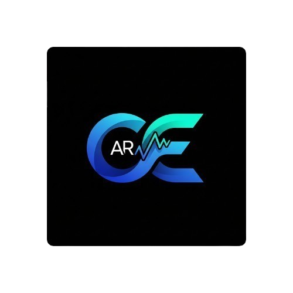

# Final Project Teknologi Multimedia

## Kelompok 8
| Nama                     | NRP        |
| ------------------------ | ---------- |
| Rizki Ramadhani          | 5027221013 |
| Gavriel Pramuda Kurniaadi     | 5027221031 |
| Rahmad Aji Wicaksono        | 5027221034 |
| Ahmad Fauzan Daniswara          | 5027221057 |

<br>

# Conversee - Currency Converter OCR & AR

<div align="center">
 
</div>

Conversee adalah aplikasi Android berbasis Augmented Reality (AR) yang memungkinkan pengguna mengonversi harga mata uang secara instan hanya dengan mengarahkan kamera ke label harga. Aplikasi ini didesain untuk menghadirkan pengalaman visual yang modern, cepat, dan mudah dipahami.

---

## Fitur Utama

* **Konversi Mata Uang Real-time:** Dapatkan nilai tukar terkini untuk berbagai mata uang global.
* **Pemindaian OCR:** Pindai angka dan teks mata uang langsung dari kamera.
* **Augmented Reality (AR):** Lihat hasil konversi mata uang yang diproyeksikan langsung di atas objek di dunia nyata melalui kamera Anda.
* **Antarmuka Intuitif:** Desain UI/UX yang bersih dan mudah digunakan untuk pengalaman konversi yang mulus.
* **Dukungan Multi-Mata Uang:** Konversi antara berbagai pasangan mata uang yang didukung.

---

## Teknologi yang Digunakan

* **Kotlin / Java:** Bahasa pemrograman utama yang digunakan untuk membangun seluruh aplikasi Android ini, menyediakan fondasi yang kokoh dan efisien untuk pengembangan.
* **Android SDK:** Kumpulan *tools* pengembangan lengkap dari Google yang menjadi dasar untuk membangun aplikasi Android, mencakup API, *libraries*, dan dokumentasi yang diperlukan.
* **Firebase:** Digunakan sebagai solusi *backend* untuk database, memungkinkan penyimpanan dan pengelolaan data aplikasi secara *real-time*.
* **Google ML Kit:** Memanfaatkan kemampuan *Machine Learning* dari Google untuk implementasi fitur OCR (Optical Character Recognition), memungkinkan aplikasi mengenali dan mengekstrak teks dari gambar.
* **ExchangeRate API:** Digunakan untuk mendapatkan data nilai tukar mata uang terkini. API ini penting untuk memastikan konversi mata uang selalu berdasarkan informasi paling *update*.
* **ARCore:** Platform Google untuk membangun pengalaman *Augmented Reality*, memungkinkan aplikasi memproyeksikan informasi konversi mata uang secara virtual ke dunia nyata melalui kamera perangkat.
---

## Prasyarat

Untuk membangun dan menjalankan proyek ini, Anda memerlukan:

* **Android Studio** (Versi Arctic Fox atau lebih baru sangat disarankan).
* **Android SDK** (API Level 31 "S" atau lebih tinggi).
* **Java Development Kit (JDK) 11** atau lebih tinggi.
* **Koneksi Internet** untuk mengunduh dependensi Gradle.
* **Akun Firebase Project** dan file `google-services.json` yang ditempatkan di direktori `app/` (jika menggunakan fitur Firebase).
---

## Cara Menjalankan Proyek

1.  **Clone Repository:**
    ```bash
    git clone https://github.com/GavrielAdi/currency-converter-ocr-ar.git
    cd currency-converter-ocr-ar
    ```

2.  **Buka di Android Studio:**
    * Buka Android Studio.
    * Pilih `File > Open`.
    * Navigasi ke folder `currency-converter-ocr-ar` yang baru saja Anda *clone* dan klik `OK`.

3.  **Sinkronisasi Gradle:**
    * Setelah proyek terbuka, Android Studio akan mulai menyinkronkan proyek dengan file Gradle. Pastikan koneksi internet Anda stabil.

4.  **Tambahkan `google-services.json` (Jika Ada Error `processDebugGoogleServices FAILED`):**
    * Jika Anda mendapatkan *error* terkait `google-services.json` hilang, Anda perlu membuat proyek Firebase baru (atau menggunakan yang sudah ada) dan menambahkan aplikasi Android Anda ke dalamnya.
    * Unduh file `google-services.json` dari konsol Firebase dan letakkan di direktori `app/` di proyek Anda (`currency-converter-ocr-ar/app/google-services.json`).

5.  **Build Proyek**

6.  **Jalankan Aplikasi:**
    * Hubungkan perangkat Android fisik Anda (pastikan mode Debugging USB aktif) atau luncurkan emulator Android.
    * Klik tombol `Run 'app'` (ikon panah hijau) di *toolbar* Android Studio.

---
